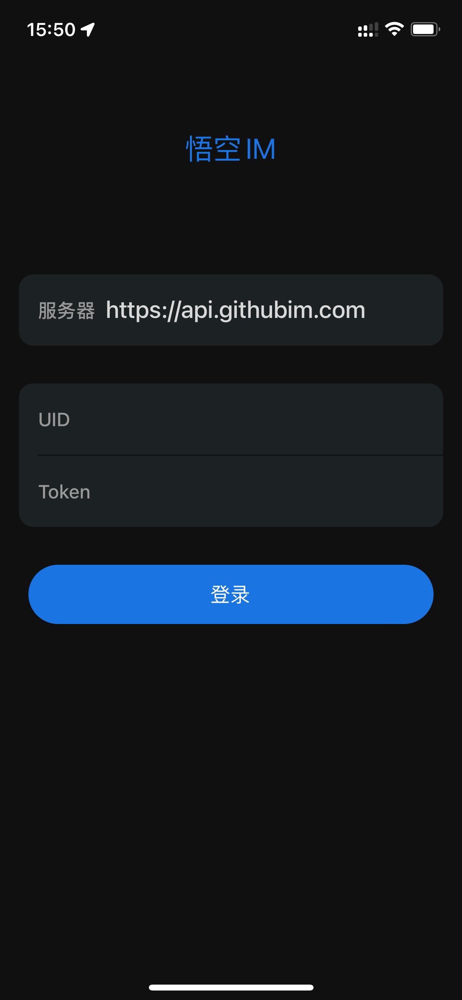
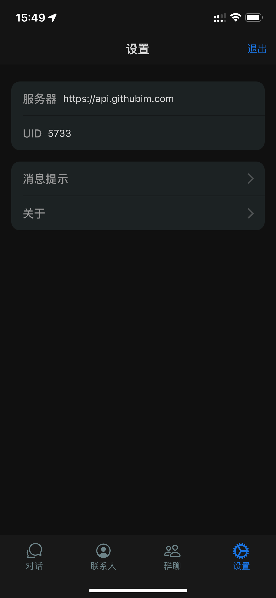

# 悟空IM React Native Demo

本项目是[悟空IM](https://githubim.com/) react native 端功能演示。聊天功能基于基于[悟空IM JavaScript SDK](https://githubim.com/sdk/javascript.html)。react native 基于 [Expo](https://expo.dev/)

## app体验

- [iOS](https://testflight.apple.com/join/s0NwSQ7l)
- [Android](https://www.pgyer.com/wukongim)

## 截图

<!-- | ---- | ---- | ---- | ---- | -->
|  |  |  |  |
| ---- | ---- | ---- | ---- |


## 开发

### 环境要求

- [nodejs](https://nodejs.org/)
- Expo Go app [iOS](https://apps.apple.com/app/apple-store/id982107779) [Android](https://play.google.com/store/apps/details?id=host.exp.exponent&referrer=www)

安装依赖

```shell
yarn
```

运行
```shell
yarn start
```

## 构建

- 安装 eas 
```shell
npm install -g eas-cli
```
- 注册 [expo](https://expo.dev/) 账号并登录 
```shell
eas login
```
- 首次运行需删除app.json中 `expo.extra.eas` 配置信息，否则会报错

### 线上

### iOS

```shell
eas build -p ios
```

### Android

```shell
eas build -p android --profile preview
```

### 本地

注意！本地打包需配置原生(iOS\Android)[开发环境](https://reactnative.dev/docs/environment-setup)

### iOS

```shell
eas build -p ios --local
```

### Android
 
```shell
eas build -p android --profile preview --local
```

## schema

打开指定频道

```shell
npx uri-scheme open "exp://127.0.0.1:19000/--/chat?channelId=test&channelType=2" --ios
```
